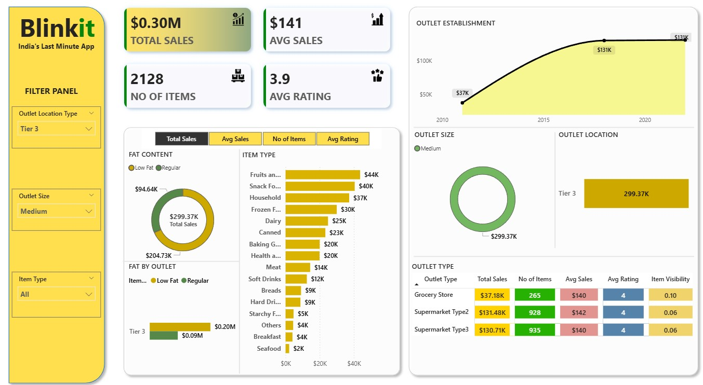

# 🛒 Blinkit Sales Analysis Dashboard


## 🎯 Objective

To analyze sales performance and customer behavior using an interactive Power BI dashboard.

---

## 🛠️ Tools Used

* Power BI

---

## 📂 Dataset

The dataset includes:

* Product categories
* Outlet type and size
* Sales data
* Customer ratings

---

## 🔍 Project Workflow

* Data cleaning and transformation
* Designed interactive dashboard
* Created KPIs for sales, items, and ratings
* Analyzed performance across outlets and categories

---

## 📈 Key Insights

* Sales performance varies by outlet type and size
* Certain product categories generate higher revenue
* Customer ratings influence product performance

---

## 📊 Dashboard Preview




---

## 🚀 Conclusion

The dashboard provides valuable insights into sales trends and helps businesses make data-driven decisions.

---

## 📁 Project Structure

```
Blinkit-Sales-Analysis/
│── BLINKIT.pbix
│── BlinkIT Grocery Data.xlsx
│── blinkit.jpg
│── README.md
```

